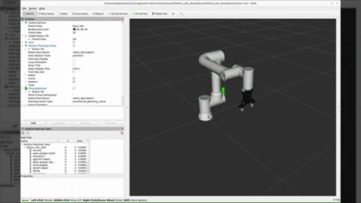

# MoveIt2 Basic MTC Demo Tutorial

This tutorial demonstrates the implementation of the basic **MoveIt Task Constructor (MTC)** demo provided by MoveIt2 for the **FR5 Collaborative Robot** integrated with a **DH Robotics gripper**.

<p align="center">
  
</p>

---

# What is MoveIt Task Constructor (MTC)?

MoveIt Task Constructor (MTC) is a framework within MoveIt2 designed for building complex robotic manipulation tasks in a modular and structured way.

MTC enables developers to create robotic workflows such as:

- Pick and place
- Object grasping
- Motion sequencing
- Cartesian path planning
- Multi-stage task execution

The framework divides robotic tasks into smaller stages, making applications easier to debug, customize, and extend.

---

# Getting Started

## Clone the Repository

First, clone the repository into your ROS2 workspace:

```bash
git clone https://github.com/Devonics-Inc/fairino-moveit2
```

---

# Build the Workspace

After cloning the repository, build the workspace using:

```bash
# Replace the path below with your actual workspace path
cd ~/path/to/repo/mtc-fairino-demo

colcon build
```

---

# Source the Workspace

Once the build process is complete, source the workspace:

```bash
source install/setup.bash
```

---

# Running the Demo

Before running the demo, make sure that:

- The cobot is connected to your PC, OR
- The simulator is already running

## Start the Docker Container

```bash
# Replace "fair395" with your actual container name
sudo docker start fair395
```

---

## Launch the Robot Environment

Run the following command to launch the simulation and MoveIt2 environment:

```bash
ros2 launch fairino_mtc_demo mtc_demo_env.launch.py
```

---

## Run the Pick-and-Place MTC Demo

Run the following command to start the MTC pick-and-place application:

```bash
ros2 launch fairino_mtc_demo mtc_demo_app.launch.py
```

---

# Notes

- Ensure MoveIt2 is properly installed and configured.
- Verify that the robot controllers are active before running the demo.
- RViz2 can be used to visualize planning and task execution.
- Make sure Docker permissions are properly configured if running without `sudo`.

---