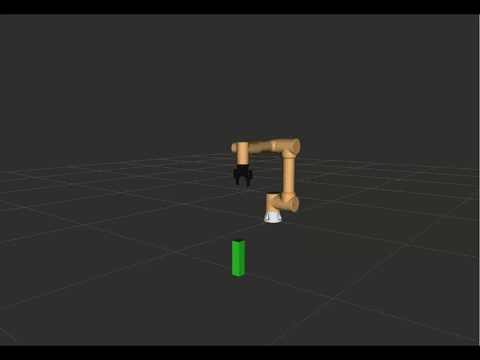
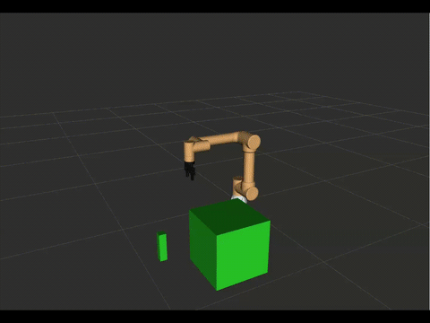
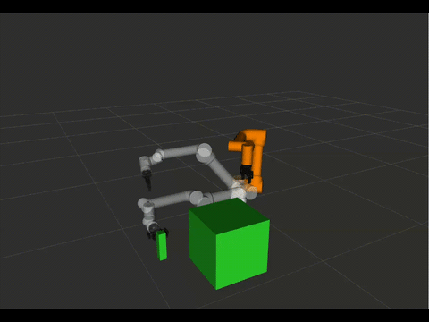

# Fairino MoveIt2 

This repository provides a comprehensive, step-by-step workflow for integrating **Fairino Collaborative Robots** with **MoveIt2**, covering everything from initial simulation to real-world hardware deployment and gripper integration.

<table>
  <tr>
    <td></td>
    <td></td>
    <td></td>

  </tr>
</table>
MoveIt 2 is a motion planning framework built on top of ROS2 that adds advanced robotic capabilities such as trajectory planning, collision avoidance, kinematics solving, scene awareness, and motion execution. Instead of manually controlling each robot joint, MoveIt2 allows users to define target positions or poses while the framework automatically computes safe and optimized robot motions. It also provides powerful visualization and interaction tools through RViz, making it easier to simulate, validate, and debug robotic applications before deploying them to a real cobot.

# Tutorials Overview

## 1. MoveIt2 Base Setup (`moveit/`)
This directory contains the foundation for the environment.
* **Includes**: ROS 2 Humble environment verification, MoveIt2 installation, and building core Fairino packages (`fairino_description`, `fairino_msgs`).
* **Outcome**: A functional RViz2 demo using mock components for offline motion planning.

## 2. Real Robot Integration (`moveit-cobot-integration/`)
This section focuses on the transition from a "mock" system to a physical robot.
* **Includes**: Overwriting `ros2_control` Xacro files to use the `FairinoHardwareInterface` and configuring system libraries (`libfairino.so.2`).
* **Outcome**: Direct communication between MoveIt2 and the physical Fairino controller.

## 3. Gripper Integration (`moveit2-gripper-integration/`)
This multi-part tutorial demonstrates how to add a DH Robotics AG95 gripper to your setup.
* **Includes**: Merging URDF/Xacro models, generating planning groups for the end-effector, and configuring hybrid controllers to manage both the real arm and the gripper.
* **Outcome**: A fully integrated system capable of advanced pick-and-place operations.

# Recommended Learning Path

It is recommended to follow the tutorials in this specific order:

1.  **`moveit/`**: Establish your base workspace and ensure MoveIt2 is planning correctly in simulation.
2.  **`moveit-cobot-integration/`**: Connect to your physical Fairino robot. Verify that the "real" hardware interface is responding to MoveIt commands before adding peripherals.
3.  **`moveit2-gripper-integration/`**: Once the arm is moving safely, follow the guide to merge the gripper URDF, update planning groups, and finalize the hybrid control configuration.

