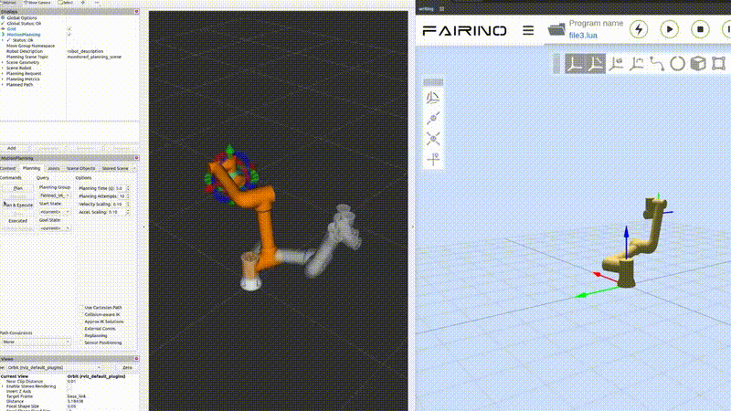
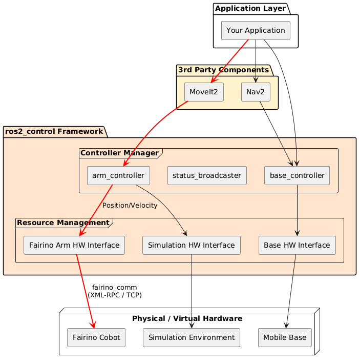
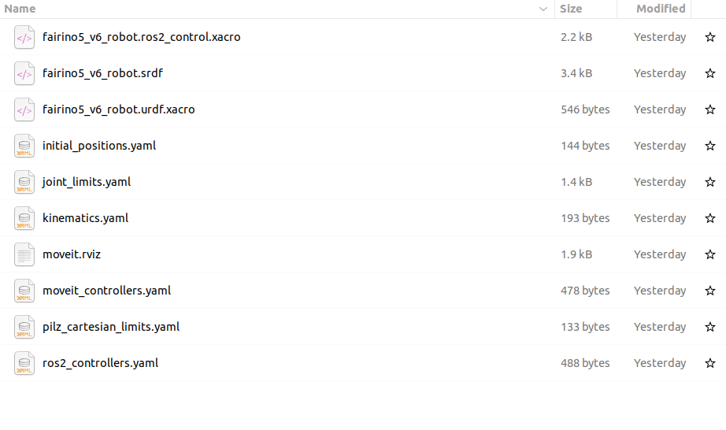
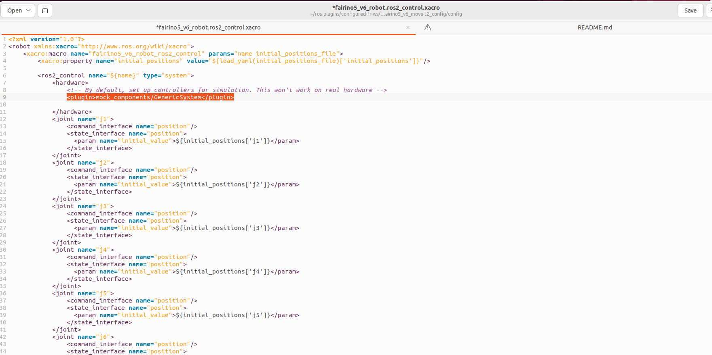
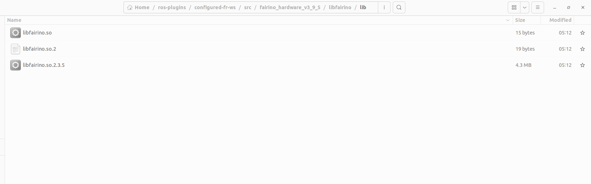

# Integrating your fairino cobot with moveit2

This tutorial focuses on the steps required to integrate your Fairino FR collaborative robot with MoveIt2, enabling advanced motion planning, collision avoidance, and safe robot interaction within complex environments.

By following this guide, you will learn how to:

- Integrate the Fairino robot for MoveIt2
- Launch and visualize the robot using RViz2
- Enable obstacle-aware path planning

This setup provides a flexible framework for developing safe and intelligent robotic applications using ROS2 and MoveIt2.


<p align="center">
  
</p>

# Overview


The Fairino MoveIt 2 integration utilizes a decoupled, four-tier pipeline to translate high-level Cartesian targets into safe, real-time physical robot motion.
<p align="center">
  
</p>  

The core computational heavy lifting, including inverse kinematics (IK), dynamic collision avoidance, and trajectory planning—is managed entirely by **MoveIt**. Once a safe path is calculated, MoveIt dispatches the structured trajectory waypoints to the designated **ROS 2 Arm Controller** (`JointTrajectoryController`). 

This controller is responsible for deterministically sequencing and interpolating these waypoints into a high-frequency, real-time command stream. These continuous commands are then fed directly into the **Fairino Hardware Interface**, which translates and executes the joint profiles natively across the physical **Fairino Cobot**.

# 1. Prerequisites

Before starting this tutorial, make sure you have successfully completed the `Getting Started with the Fairino MoveIt2 Plugin` tutorial.

You can still follow this guide without completing the previous tutorial, but you will need to manually clone the Fairino ROS2 repository using the following command:

```bash
git clone https://github.com/FAIR-INNOVATION/frcobot_ros2.git
```

# 2. Prepare Configuration Files

Before starting this section, you can either copy the source files into a separate workspace or continue using the existing plugin workspace. If you want to preserve the original tutorial setup.

Navigate to the ROS2 plugin repository corresponding to your Fairino cobot model.

In the same directory, make a new folder, this will be the workspace holding the new configuration to integrate moveit with the actual cobot.

```bash
cd ~/path/to/plugin/frcobot_ros2
cd ../
mkdir -p configured-fr-ws/src
```

<p align="center">
  
</p>


Now you can move into the configured-fr-ws/src subfolder and then copy the fairino5_v6_moveit2_config,fairino_description, fairino_hardware_v3_9_5, fairino_msgs  file from the original plugin into the src subfolder 

```bash
# Go to the frcobot_ros2 repository
cd ~/path/to/plugin/frcobot_ros2
```

```bash
# Copy the MoveIt config package into your configured workspace src folder
cp -r fairino5_v6_moveit2_config ../configured-fr-ws/src/
cp -r fairino_description ../configured-fr-ws/src/
cp -r fairino_hardware_v3_9_5 ../configured-fr-ws/src/
cp -r fairino_msgs ../configured-fr-ws/src/
```


# 3. Overwrite configuration

In this step, we overwrite the default configuration to enable the integration between the Fairino hardware interface and MoveIt2, allowing direct control of the cobot through MoveIt2.


### 3.1.1 `fairino5_v6_robot.ros2_control.xacro` Modification


Navigate to the following directory:

```bash
cd /path/to/ros-plugins/configured-fr-ws/src/fairino5_v6_moveit2_config/config
```

Open the following file:

```bash
fairino5_v6_robot.ros2_control.xacro
```

Locate the following line:

```xml
<plugin>mock_components/GenericSystem</plugin>
```

Replace it with:

```xml
<plugin>fairino_hardware/FairinoHardwareInterface</plugin>
```

<p align="center">
  
</p>

### 3.1.2 `fairino5_v6_robot.urdf.xacro` Modification

In this step, we modify the `fairino5_v6_robot.urdf.xacro` file to enable the Fairino hardware interface configuration.

Navigate to the following directory:

```bash
cd /path/to/ros-plugins/configured-fr-ws/src/fairino5_v6_moveit2_config/config
```

Open the following file:

```bash
fairino5_v6_robot.urdf.xacro
```

Locate the following line:

```xml
<xacro:fairino5_v6_robot_ros2_control name="FakeSystem" initial_positions_file="$(arg initial_positions_file)"/>
```

Replace it with:

```xml
<xacro:fairino5_v6_robot_ros2_control name="FairinoHardware" initial_positions_file="$(arg initial_positions_file)"/>
```

# 4. Build & Source the Workspace

After applying the previous modifications, the workspace can now be built using `colcon`.

First, make sure you are inside the workspace directory:

```bash
cd ~/path/to/configured-fr-ws
```

Build the workspace:

```bash
colcon build
```

Then source the workspace environment:

```bash
source install/setup.bash
```

Finally, export the Fairino library path:

```bash
export LD_LIBRARY_PATH=$LD_LIBRARY_PATH:/home/hadyfarahat/ros-plugins/configured-fr-ws/src/fairino_hardware_v3_9_5/libfairino/lib/
```

> **Note:**  
> You will need to source the workspace and export the library path every time before running the demo.  
> If preferred, these commands can be added to your `.bashrc` file to automate the process.
# 5. Remove Extra Library Files

Navigate to the following directory:

```bash
cd ~/path/to/configured-fr-ws/src/fairino_hardware_v3_9_5/libfairino/lib
```

You should see files similar to the ones shown below:

<p align="center">
  
</p>

Delete the following files:

```bash
rm libfairino.so
rm libfairino.so.2
```

Then rename `libfairino.so.2.3.5` to `libfairino.so.2`:

```bash
mv libfairino.so.2.3.5 libfairino.so.2
```

> **Important:**  
> This step is required to prevent MoveIt2 from failing to initialize communication commands with the cobot, otherwise it might utilize the wrong library.


## Run MoveIt2

Open a new terminal, navigate to the `configured-fr-ws` workspace, and run the following commands:

```bash
cd ~/path/to/configured-fr-ws

source install/setup.bash
export LD_LIBRARY_PATH=$LD_LIBRARY_PATH:/home/hadyfarahat/ros-plugins/configured-fr-ws/src/fairino_hardware_v3_9_5/libfairino/lib/

ros2 launch fairino5_v6_moveit2_config demo.launch.py
```
