# Fairino MoveIt2

This tutorial focuses on the steps required to integrate your Fairino FR collaborative robot with MoveIt2, enabling advanced motion planning, collision avoidance, and safe robot interaction within complex environments.

By following this guide, you will learn how to:

- Configure the Fairino robot for MoveIt2
- Launch and visualize the robot using RViz2
- Perform motion planning and trajectory execution
- Enable obstacle-aware path planning
- Simulate and test robot movements before deployment
- Build a foundation for integrating grippers, sensors, and custom applications

This setup provides a flexible framework for developing safe and intelligent robotic applications using ROS2 and MoveIt2.

# 1. Prerequisites

Before starting this tutorial, make sure you have successfully completed the base MoveIt2 setup tutorial and verified that your Fairino robot environment is functioning correctly.


# 2. Configuration Steps

At this stage, you can either copy the source files into a separate workspace or continue using the existing plugin workspace. If you want to preserve the original tutorial setup, it is recommended to create a backup copy before making any modifications.

Next, navigate to the ROS2 plugin repository corresponding to your Fairino cobot model. Use the path below to access the configuration source files:


```bash
cd ~/path/to/plugin/frcobot_ros2
cd ../
mkdir configured-fr-ws
```
In the same directory, make a new folder, this will be the workspace holding the new configuration to integrate moveit with the actual cobot.

<p align="center">
  
</p>


Now you can move into the configured-fr-ws and make a src subfolder and then copy the configuration file from the original plugin into the src file 

```bash
# Go to the frcobot_ros2 repository
cd ~/path/to/plugin/frcobot_ros2
```

```bash
# Copy the MoveIt config package into your configured workspace src folder
cp -r fairino5_v6_moveit2_config ../configured-fr-ws/src/
cp -r fairino_description ../configured-fr-ws/src/

```

Now we move to the configured-fr-ws and build the configuration files.

```bash
cd ~/path/to/configured-fr-ws

```

```bash
colcon build
source install/setup.bash
```

inside the same directory we can run the moveit configuration tool by running the following command

```bash
ros2 launch moveit_setup_assistant setup_assistant.launch.py
```
## 2.1 Import your robot model

You will be prompted with moveit setup assisatnat, this tool is essetnaily there to assist you creating the semantic description file or SRDF, yaml configuration, other files.

From the window, choose create new movit configuration package, browse and choose the urdf of your model in this tutorial we will proceed with fairino5_v6.urdf as shown in the screenshot below.

<p align="center">
  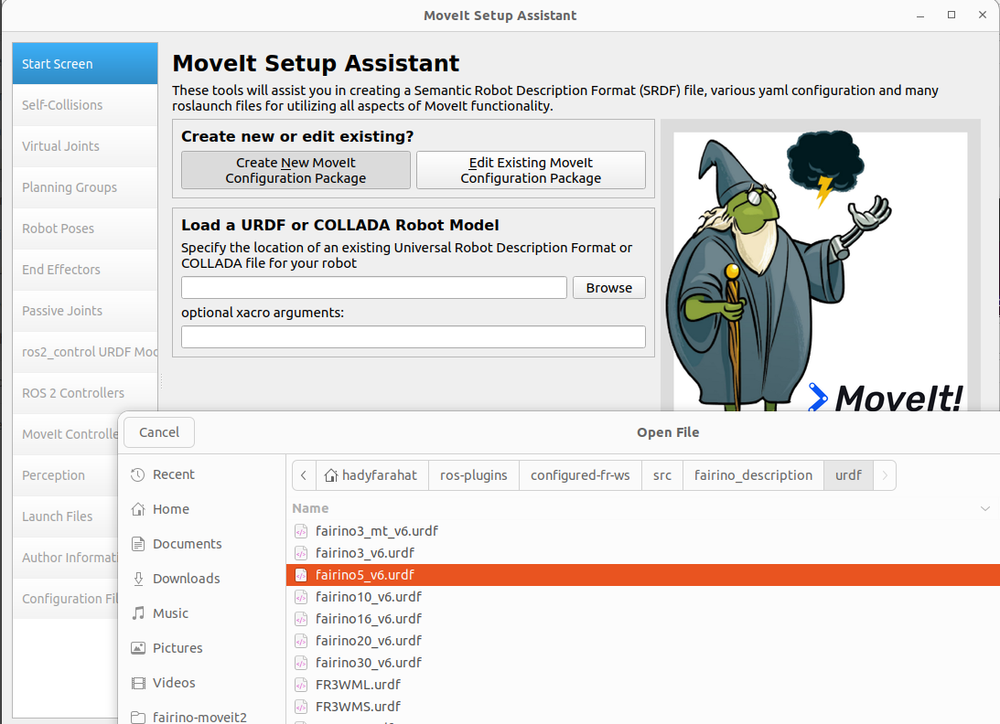
</p>


> **Note:**  
> make sure you are standing in the same directory that includes the urdf, and double check that you sourced the folder after building, this might make the tool close abrubpty when you exit it.


if you managed to properly import the model, you should be able to load the files and you will see the followig model visualized 
<p align="center">
  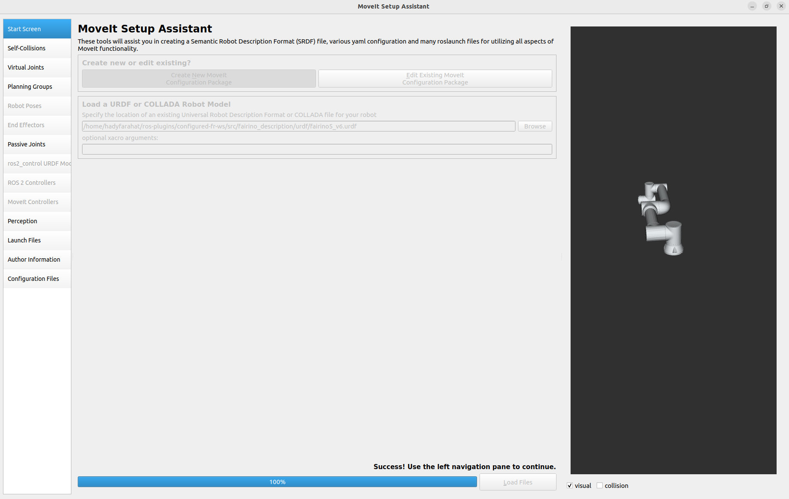
</p>

## 2.2 Generate self-collision matrix 
In this steps we generate the collision matrix for the cobot, this configuraiton is responsible for disabling the parts that automatically collide with each other for example the first and second joint will be colliding therfore their collision can be disabled.


<p align="center">
  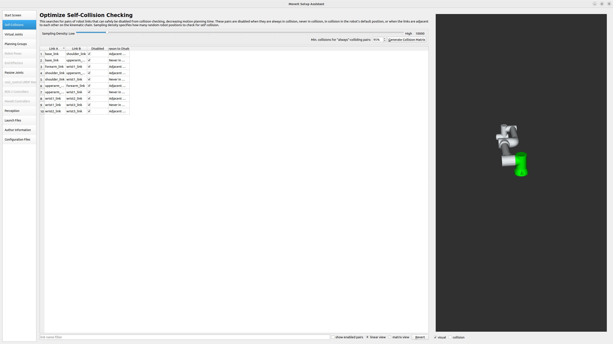
</p>

## 2.3 Define virtual joint 
virtual joint allow you to define the cobot with an artifical refrence, this can be useful if the cobot is attached to a mobile robot.

In the Virtual Joint Name set it to:
```bash
virtual_joints
```
In the Parent Frame Name:

```bash
world
```

<p align="center">
  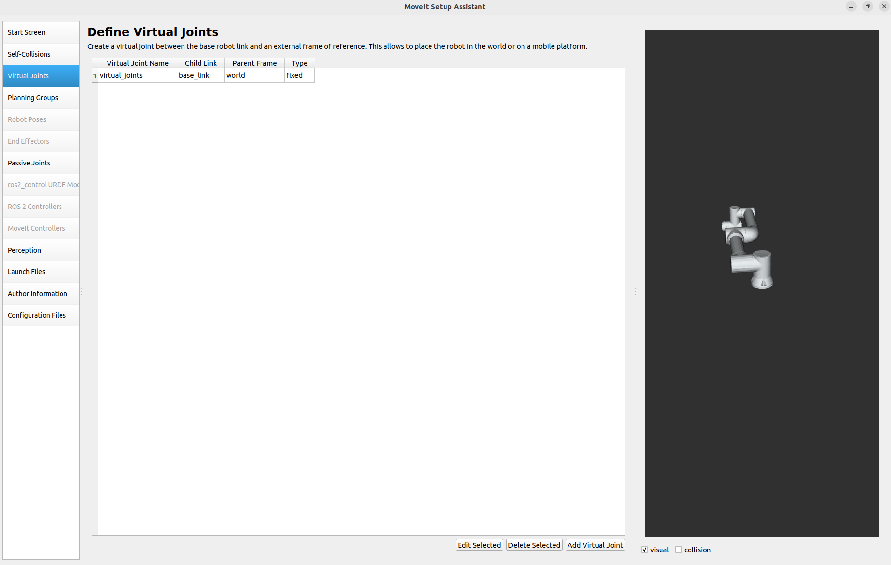
</p>


## 2.4 Define planning groups

In this step we define the planning group, this include a set of joints into the same group

in the group name you can write 

```bash
arm
```

in the kinemtic solver look for kdl_kinemtics_plugin/KDLKineticsPlugin

for the group defaul planner choose TRRT 

finally choose add joints 


Then select all the joints and move them to the selected joints, then save 


<p align="center">
  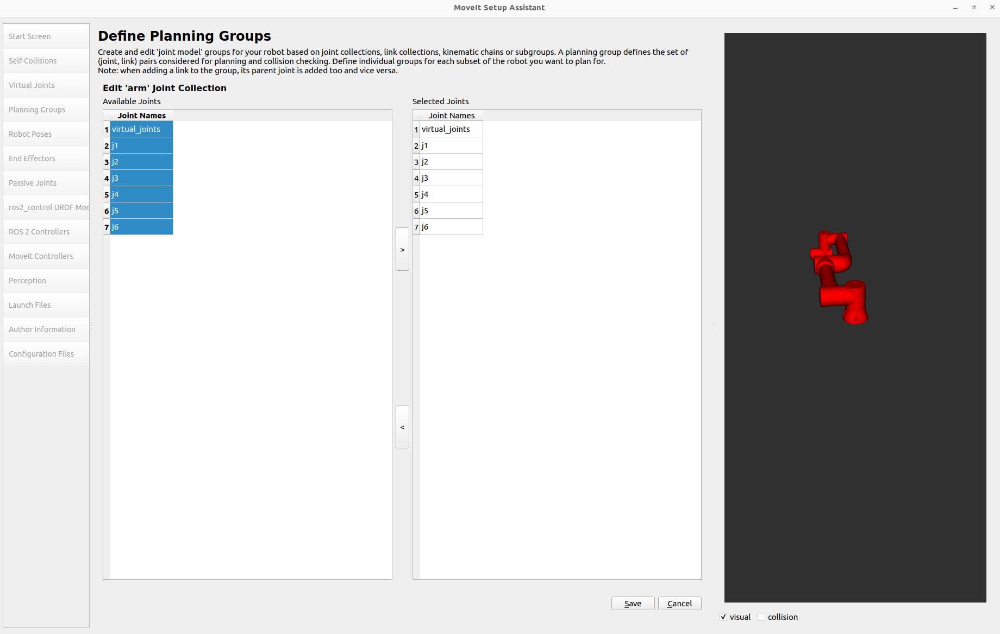
</p>


## 2.4 Define Robot Pose

you can make an initial point to to Home, you can leave joints as they are 

<p align="center">
  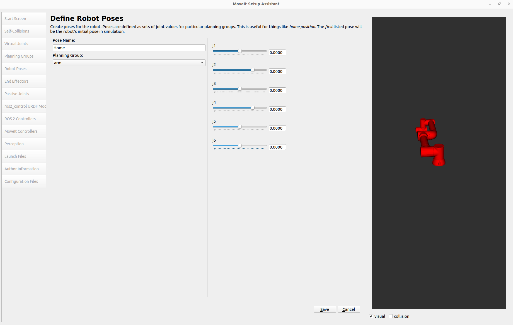
</p>


## 2.4 ros2_control URDF Modifications

In this step we define the command and the state interfaces, keep only the position in both of them checked, then add interfaces.

<p align="center">
  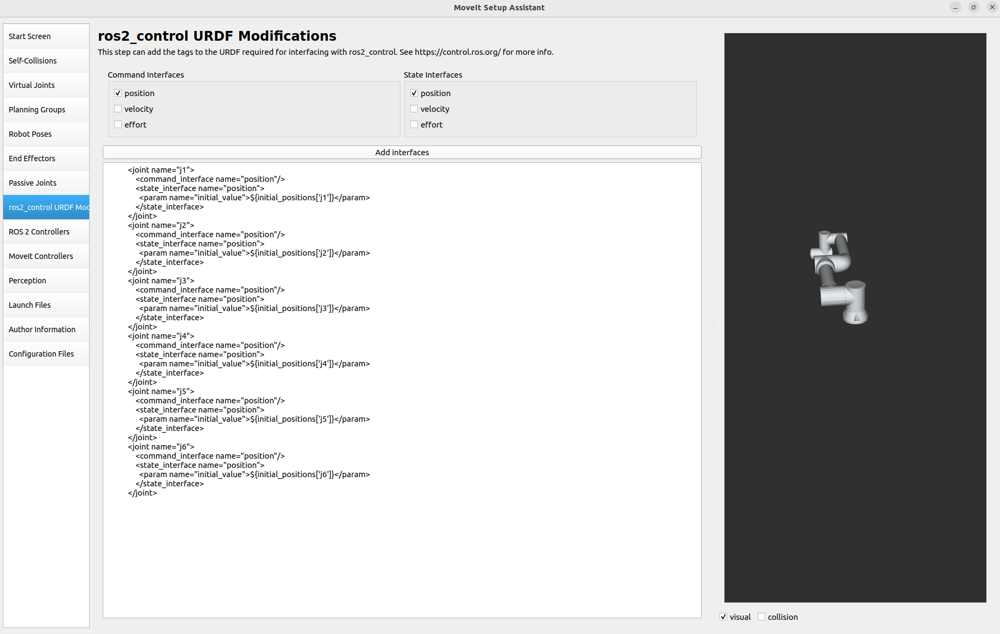
</p>


## 2.5 Ros 2 Controllers

Auto Add the joints and proceed 


<p align="center">
  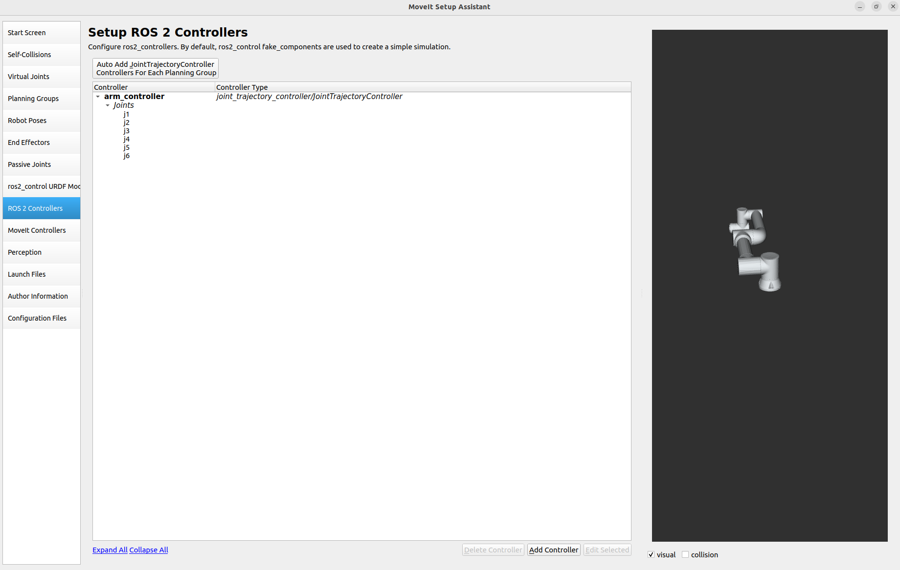
</p>


## 2.6 Moveit Controllers

Auto Add and proceed 


<p align="center">
  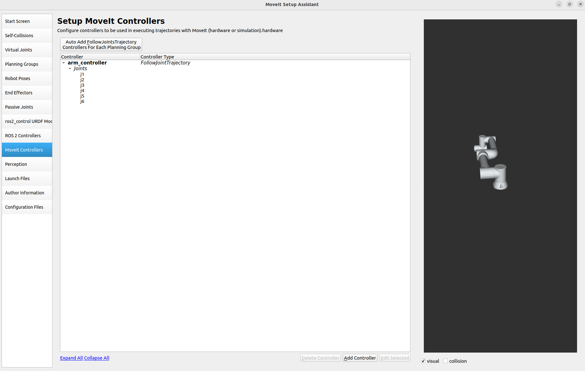
</p>


## 2.7 Author infromation

Add the author infomration as shown below, skipping this part might trigger an error later.

<p align="center">
  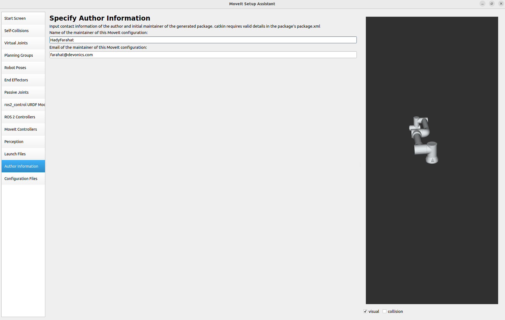
</p>


## 2.8 Export the configuraton

In this step, you will have to export the configuration to the workspace 

browse to the configured-fr-ws directory, then choose src/fairino5_v6_moveit2_config

Then you will have to generate the package  and exist the setup assistant.
<p align="center">
  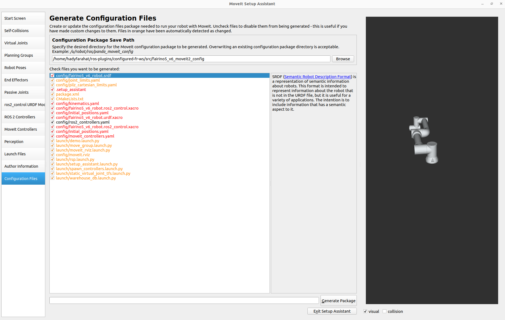
</p>


## 2.8.1 Overwrite the configuration

at this step, we overwrite the configuraiton, to allow the integration between fairino hardware module and moveit, enabling the user to control the cobot using moveit directly


you will have to replace this line 

```bash
 <plugin>mock_components/GenericSystem</plugin>
```
with this line 
```bash 
 <plugin>fairino_hardware/FairinoHardwareInterface</plugin>
```

<p align="center">
  
</p>


now you will have to overwrite the moveit_controllers using adding this line betwen type and joints 

```bash
 action_ns: follow_joint_trajectory
```

<p align="center">
  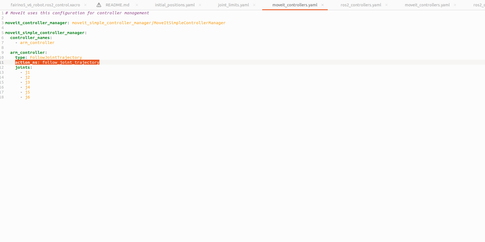
</p>


Now you will have to rebuild and source everything 

```bash
colcon build
source install/setup.bash
```