# Integrating the Gripper with the Robot – Part 2: Preparing the MoveIt 2 Package

This tutorial builds on Part 1, where we created the integrated URDF. In this section, we generate the MoveIt 2 configuration package using the integrated robot model.


<p align="center">
  
</p>

# Requirements

Before starting, make sure you have the following installed:

1) Ubuntu 22.04.5 LTS  
2) ROS 2 Humble  
3) Fairino Moveit2 plugin
4) Finished Part 1 or clone the `frg_gripp_int_ws` repo and build it

# Quick Recap

To include the gripper in your MoveIt setup, the process mainly consists of three steps:

1. ~~Create a unified robot description file (URDF) that combines both the robot and the gripper — .~~ **Finished this at part1** 
2. Generate a MoveIt configuration package, either manually or using the MoveIt Setup Assistant.  
3. Configure the MoveIt package for integration with the FR collaborative robot.


## 2.0 Copy FR5 Old Configuration

The first step is to copy the existing MoveIt configuration package. This package will later be overwritten with the configuration generated using the MoveIt Setup Assistant.

To do this, run the following commands:

```bash
# Update the path according to your workspace
cd ~/ros-plugins/frg_gripp_int_ws/src
cp -r ~/ros-plugins/frcobot_ros2/fairino5_v6_moveit2_config .
```
<p align="center">
  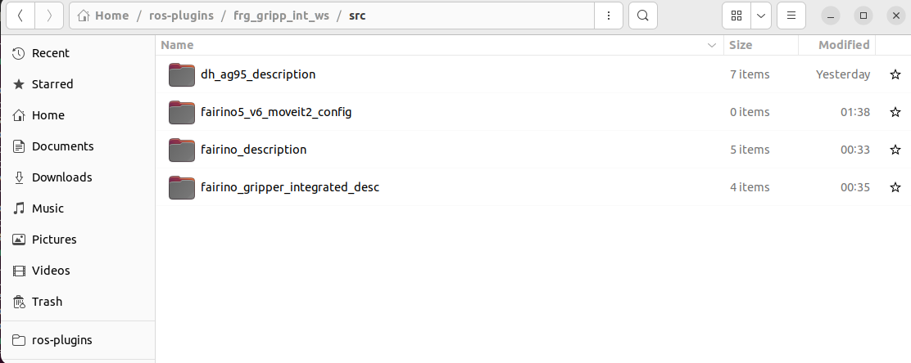
</p>

## 2.1 Import the integrated model into Moveit2 Setup Assistant


```bash
cd  ~/path/to/ros-plugins/frg_gripp_int_ws

colcon build 

source install/setup.bash

ros2 launch moveit_setup_assistant setup_assistant.launch.py

```
Then select **Create New MoveIt Configuration Package**.

<p align="center">
  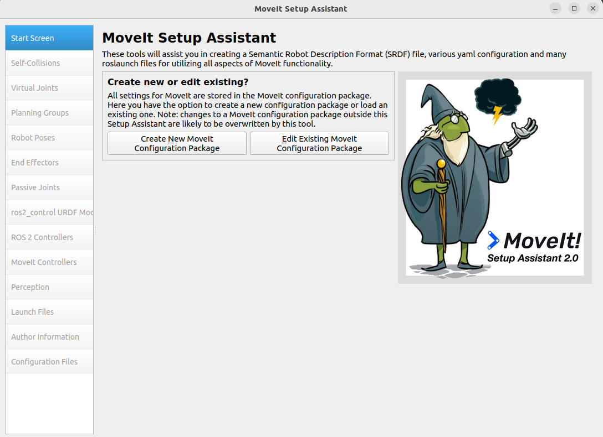
</p>

You will be prompted with the import options. Choose the integrated URDF created in Part 1 of this tutorial and click **Load Files**.

<p align="center">
  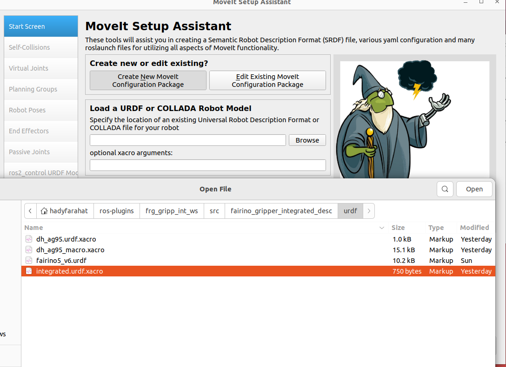
</p>

> **Note:**  
> If the loading process fails, it is usually due to one of the following reasons:
> - The workspace was not sourced after building.  
> - The URDF is located in a different workspace from the one you built or sourced.


## 2.2 Define self-collision 

Since some parts of the cobot are allowed to collide—for example, the end of joint 1 and the start of joint 2, we need to inform MoveIt about these exceptions.

You can generate the initial collision matrix by selecting **Auto Collision Matrix** in the MoveIt Setup Assistant.

<p align="center">
  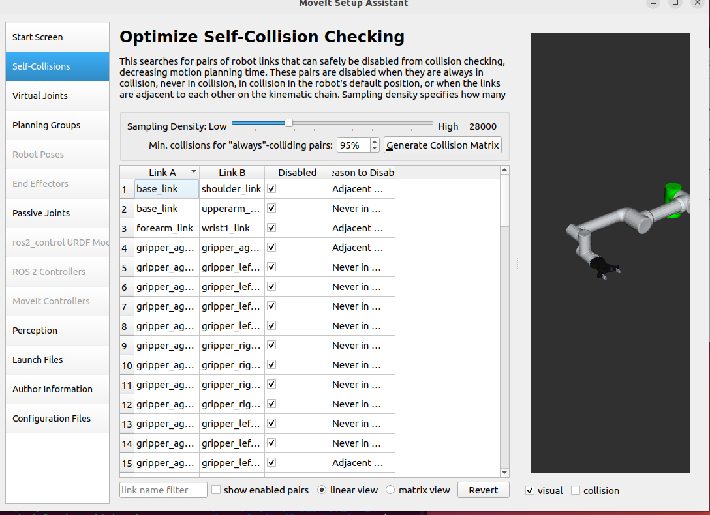
</p>

## 2.2 Define Planning Groups

You can now define a planning group, select a kinematics solver, and set the default planner for the group. Then click **Add Joints**.

<p align="center">
  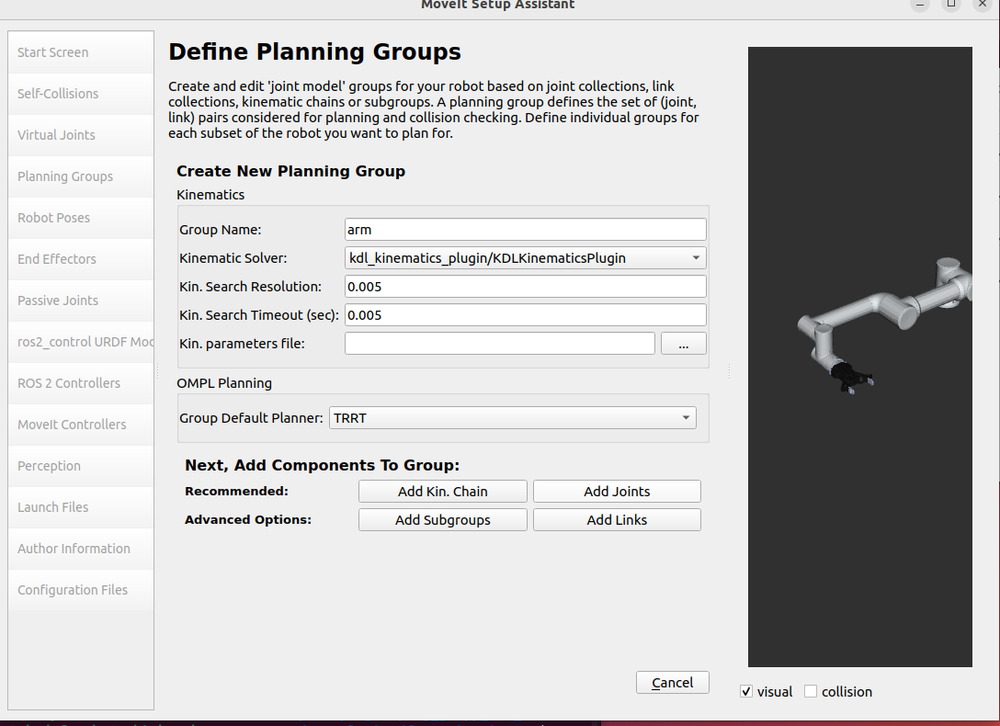
</p>

Select joints 1 to 6 and add them to the planning group.

<p align="center">
  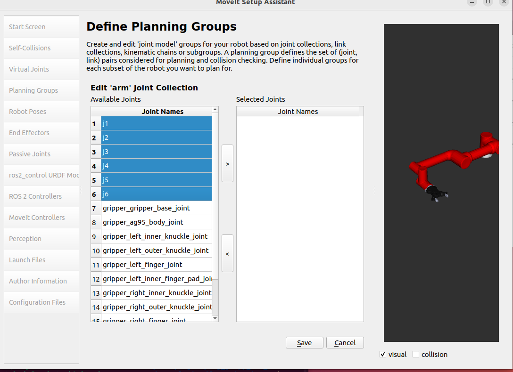
</p>


## 2.3 Define Planning Groups
ros2_control urdf modifciation, make sure that you uncheck the position and then click on **add interfaces**, this is important to interface weith ros2_control 


<p align="center">
  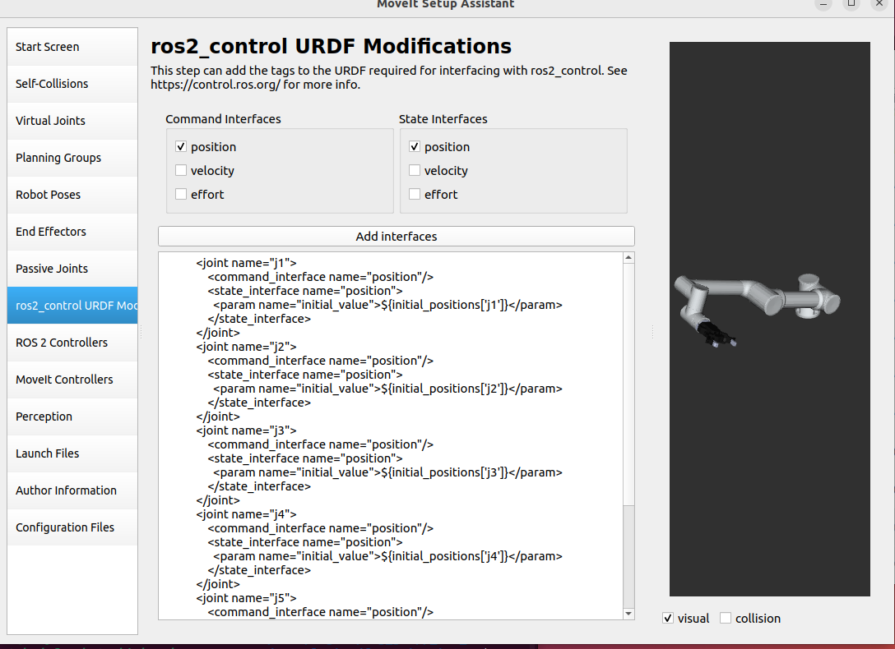
</p>

## 2.4 Define ROS 2 Controllers 

Auto Add Joint TrajectoryController for the planning groups


<p align="center">
  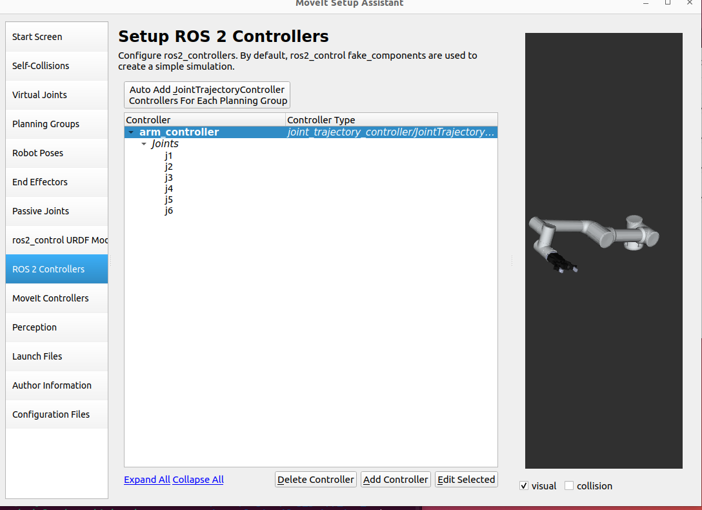
</p>


## 2.5 Define ROS Moveit Controllers  

Auto Add FollowJointsTrajectory Controllers for each planning group


<p align="center">
  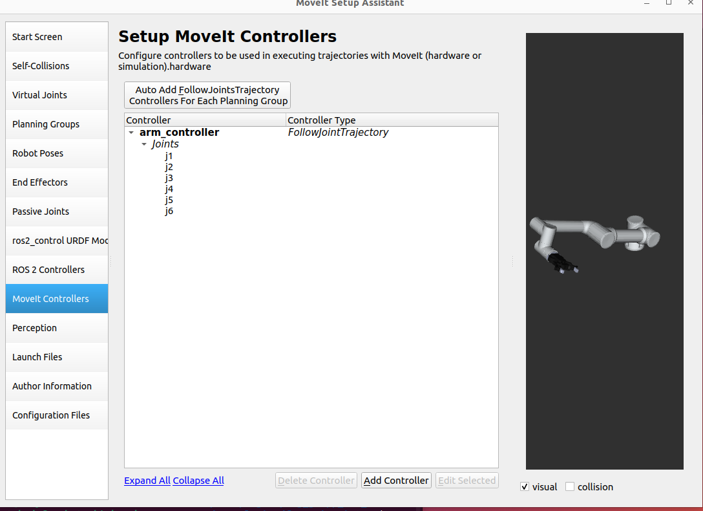
</p>


## 2.5 Add author Infomration

you can add the author information, skipping this might trigger errors 


<p align="center">
  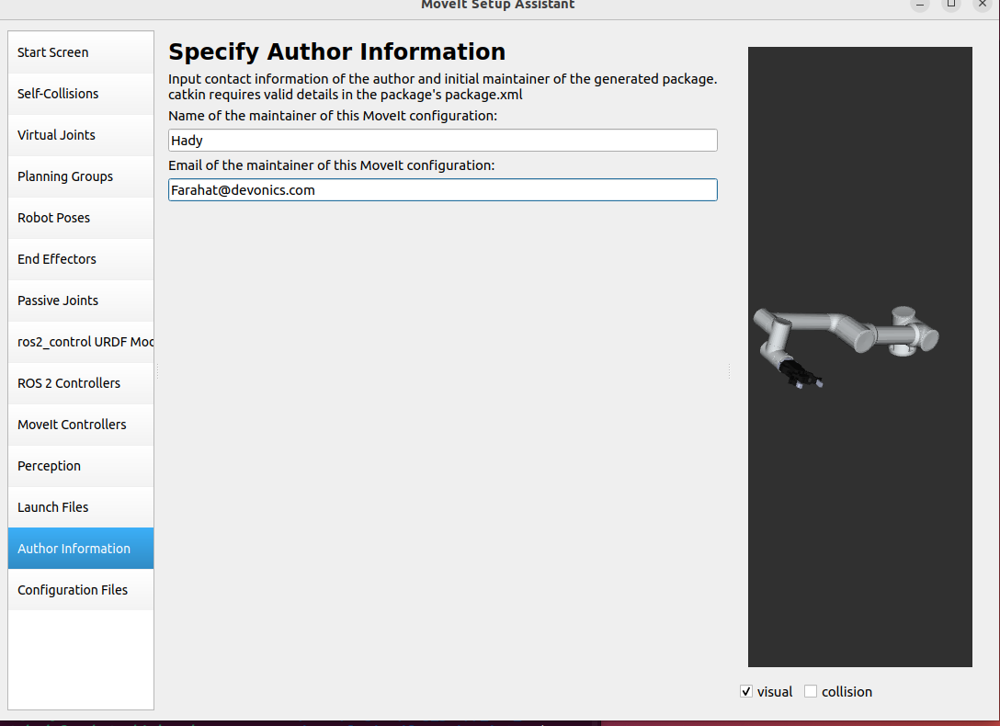
</p>


## 2.6 Export configuration

choose the old configuration package and export to it the new configuraiton, the files with red names indicates a change in these files 


<p align="center">
  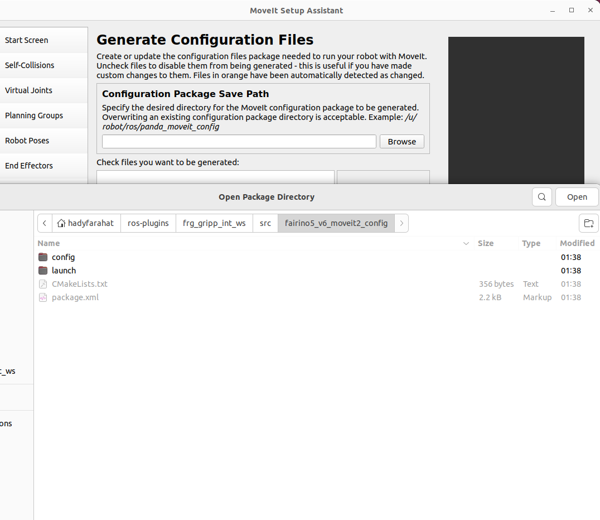
</p>


<p align="center">
  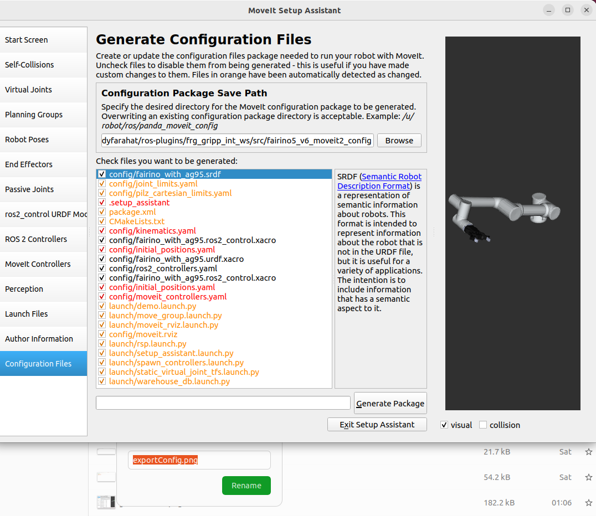
</p>


