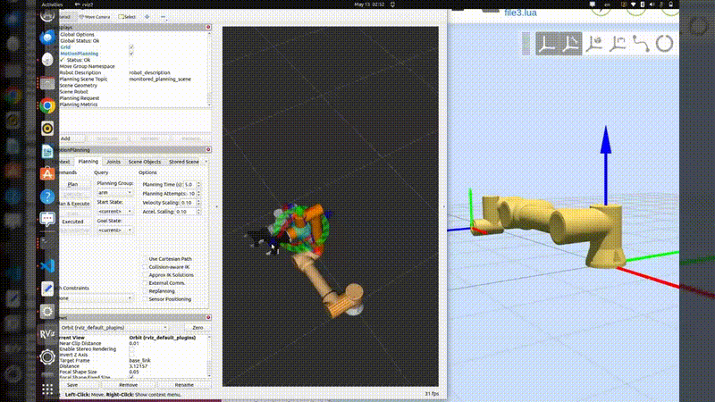

# Integrating the Gripper with the Robot – Part 3: Overwriting Moveit2 Configuration

This tutorial builds on Parts 1 and 2. In this section, we will cover the required configuration changes needed to ensure proper integration and communication between MoveIt and your cobot after adding the gripper.


<p align="center">
  
</p>

# Requirements

Before starting, make sure you have the following installed:

1) Ubuntu 22.04.5 LTS  
2) ROS 2 Humble  
3) Fairino Moveit2 plugin
4) Finished Part 1&2 or clone the `frg_gripp_int_ws` repo and build it

# Quick Recap

To include the gripper in your MoveIt setup, the process mainly consists of three steps:

1. ~~Create a unified robot description file (URDF) that combines both the robot and the gripper.~~ **Finished in Part 1**
2. ~~Generate a MoveIt configuration package, either manually or using the MoveIt Setup Assistant.~~ **Finished in Part 2**
3. Configure the MoveIt package for integration with the FR collaborative robot.


## 3.1 Modify `fairino5_v6_robot.ros2_control.xacro`
you can find this by navigating to the description file exported from moveit
```bash
# modify the path
cd /frg_gripp_int_ws/src/fairino5_v6_moveit2_config/config
```

check the file and make sure that it uses 

```bash
 <plugin>fairino_hardware/FairinoHardwareInterface</plugin>
```
instead of the default plugin shown in the screenshot below
```bash
 <plugin>mock_components/GenericSystem</plugin>
```

<p align="center">
  
</p>


## 3.2 Modify `fairino5_v6_robot.urdf.xacro`
in the same subfolder, find fairino5_v6_robot, modify the line that say `FakeSystem` to `FairinoHardware`

<p align="center">
  
</p>


## 3.3 Modify `fairino_with_ag95.ros2_control.xacro`
You will have to modify the sturcture of the xarco, so that the gripper only uses a `mock_components/GenericSystems` , while the rest of the cobot uses `fairino_hardware/FairinoHardwareInterface`

You can copy and paste the file from below

```bash
<?xml version="1.0"?>
<robot xmlns:xacro="http://www.ros.org/wiki/xacro">
    <xacro:macro name="fairino_with_ag95_ros2_control" params="name initial_positions_file">
        <xacro:property name="initial_positions" value="${xacro.load_yaml(initial_positions_file)['initial_positions']}"/>

        <!-- 1. REAL ARM HARDWARE INTERFACE -->
        <ros2_control name="FairinoArmHardware" type="system">
            <hardware>
                <plugin>fairino_hardware/FairinoHardwareInterface</plugin>
            </hardware>
            <joint name="j1">
                <command_interface name="position"/>
                <state_interface name="position">
                  <param name="initial_value">${initial_positions['j1']}</param>
                </state_interface>
            </joint>
            <joint name="j2">
                <command_interface name="position"/>
                <state_interface name="position">
                  <param name="initial_value">${initial_positions['j2']}</param>
                </state_interface>
            </joint>
            <joint name="j3">
                <command_interface name="position"/>
                <state_interface name="position">
                  <param name="initial_value">${initial_positions['j3']}</param>
                </state_interface>
            </joint>
            <joint name="j4">
                <command_interface name="position"/>
                <state_interface name="position">
                  <param name="initial_value">${initial_positions['j4']}</param>
                </state_interface>
            </joint>
            <joint name="j5">
                <command_interface name="position"/>
                <state_interface name="position">
                  <param name="initial_value">${initial_positions['j5']}</param>
                </state_interface>
            </joint>
            <joint name="j6">
                <command_interface name="position"/>
                <state_interface name="position">
                  <param name="initial_value">${initial_positions['j6']}</param>
                </state_interface>
            </joint>
        </ros2_control>

        <!-- 2. GRIPPER HARDWARE INTERFACE (MOCKED FOR STABILITY) -->
        <!-- Switch the plugin to your AG95 driver when ready -->
        <ros2_control name="AG95GripperHardware" type="system">
            <hardware>
                <plugin>mock_components/GenericSystem</plugin>
                <param name="calculate_dynamics">true</param>
            </hardware>
            <joint name="gripper_left_outer_knuckle_joint">
                <command_interface name="position"/>
                <state_interface name="position">
                  <param name="initial_value">${initial_positions['gripper_left_outer_knuckle_joint']}</param>
                </state_interface>
            </joint>
        </ros2_control>

    </xacro:macro>
</robot>
```


## 3.4 Modify `fairino_with_ag95.urdf.xacro`
In this file, replace the line containing `FakeSystem` with `FairinoHardware`.

<p align="center">
  
</p>


## 3.5 Modify `moveit_controllers.yaml`
In this section, make sure the following controller definitions are added under the controllers configuration.

```bash
arm_controller:
    type: FollowJointTrajectory
    action_ns: follow_joint_trajectory
    # rest of the configuraiton
gripper_controller:
    type: FollowJointTrajectory
    action_ns: follow_joint_trajectory
```
<p align="center">
  
</p>


## 3.6 Add dyanmic library to your shared folder (skip this if you did it before)

ove the library to a shared location so you don't need to export LD_LIBRARY_PATH each time


```bash
cd ~/ros-plugins/frg_gripp_int_ws/install/fairino_hardware_v3_9_5/lib/

# 2. Copy the .so files to the system library folder
sudo cp libfairino.so.2 /usr/local/lib/


# change the name of the libarary to so.2, moveit looks for this name
sudo ln -s /usr/local/lib/libfairino.so.2.3.5 /usr/local/lib/libfairino.so.2

```


## 3.7 Clean build
Remove any previously generated build files and start from a clean state. Then open a new terminal so that all newly added dependencies and libraries are properly recognized.


```bash
cd ~/path/to/frg_gripp_int_ws

colcon build

source install/setup.bash


ros2 launch fairino5_v6_moveit2_config demo.launch.py


```


