# Integrating the Gripper with the Robot – Part 1: Merging the URDF

In this tutorial, we cover the first step of integrating a gripper with your cobot by merging the robot and gripper models into a single URDF/Xacro file. This unified description is required before generating the MoveIt 2 configuration package.


<p align="center">
  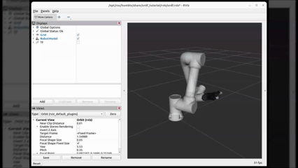
</p>

# Requirements

Before starting, make sure you have the following installed:

1) Ubuntu 22.04.5 LTS  
2) ROS 2 Humble  
3) Fairino Moveit2 plugin

# Overview

To include the gripper in your MoveIt setup, the process mainly consists of two steps:

1. Create a unified robot description file (URDF) that compines both the robot and the gripper.
2. Generate a MoveIt configuration package, either manually or using the MoveIt Setup Assistant.
3. Configure the MoveIt package for integration with the FR collaborative robot.


## 1. Create the URDF for the Gripper & Cobot

### 1.1 Create the Workspace

Before starting this tutorial, create a new workspace named `frg_gripp_int_ws`, as shown in the screenshot below.
This workspace will contain the integrated URDF, along with the mesh files for both the gripper and the cobot.


```bash
cd ~/path/to/fairino/plugin
# Make frg_gripp_int_ws directory and src subfolder
mkdir -p frg_gripp_int_ws/src
```

<p align="center">
  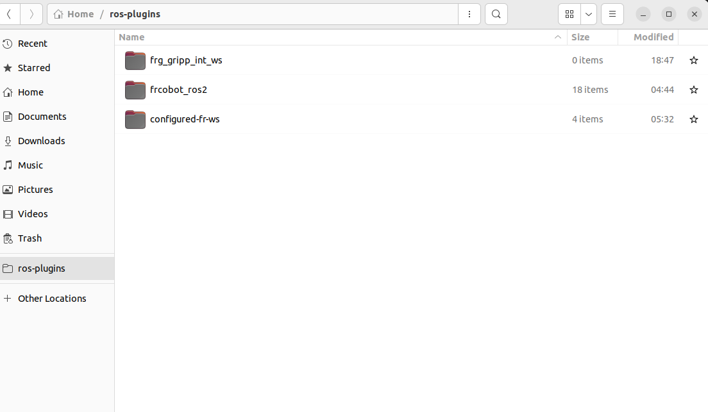
</p>


## 1.2 Clone the Gripper Repository

We recommend contacting the gripper manufacturer to obtain the required URDF and mesh files.  
In this tutorial, we will use the AG Gripper from DH Robotics.

```bash
cd frg_gripp_int_ws/src
git clone https://github.com/ian-chuang/dh_ag95_gripper_ros2.git

```

After cloning the repository, copy the required folder directly into the src directory as shown in the screenshot below.

```bash
# copy description files from the inside the ros2 folder
cp -r dh_ag95_gripper_ros2/dh_ag95_description .
```

<p align="center">
  
</p>


You can then delete the remaining files from `dh_ag95_gripper_ros2`, since they will not be needed for this tutorial.


```bash
rm -rf dh_ag95_gripper_ros2

```
## 1.3 Copy the Description Package from the Fairino Plugin

```bash
cp -r ~/ros-plugins/frcobot_ros2/fairino_description .
```
This command copies the fairino_description package from the Fairino ROS2 plugin workspace into your current src directory.

## 1.3 Create the Integration package structure

Create the integration structure using the following commands:

```bash
# ensure you are inside frg_gripp_int_ws
cd frg_gripp_int_ws/src

mkdir -p fairino_gripper_integrated_desc/meshes/{gripper,robot}
mkdir -p fairino_gripper_integrated_desc/urdf
touch fairino_gripper_integrated_desc/package.xml
touch fairino_gripper_integrated_desc/CMakeLists.txt
```

After running the commands, the directory structure should look like this:
```
frg_gripp_int_ws/
└── src/
    ├── fairino_description/
    ├── dh_ag95_description/
    └── fairino_gripper_integrated_desc/
        ├── meshes/
        │   ├── gripper/
        │   └── robot/
        ├── urdf/
        ├── package.xml
        └── CMakeLists.txt

```

### 1.3.1 Copy mesh files

Next, copy the required mesh and URDF files into their corresponding folders.

From `/path/to/ros-plugin/frcobot_ros2/fairino_description/fairino5_v6`

<p align="center">
  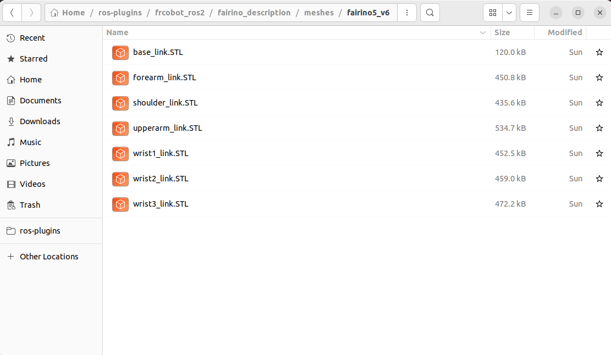
</p>


copy all `.stl` mesh files into:

```bash
frg_gripp_int_ws/src/fairino_gripper_integrated_desc/meshes/robot
```


<p align="center">
  
</p>


Then repeat the same process for the gripper files by copying:
Copy the gripper mesh files from:

```text
/path/to/ros-plugin/frg_gripp_int_ws/src/dh_ag95_description/meshes/visual
```


<p align="center">
  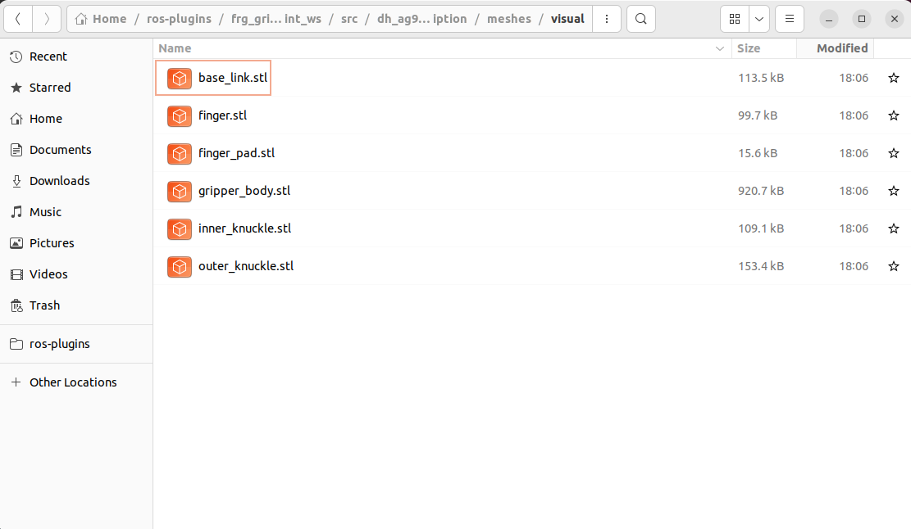
</p>


to:

```text
/path/to/ros-plugin/frg_gripp_int_ws/src/fairino_gripper_integrated_desc/meshes/gripper
```

<p align="center">
  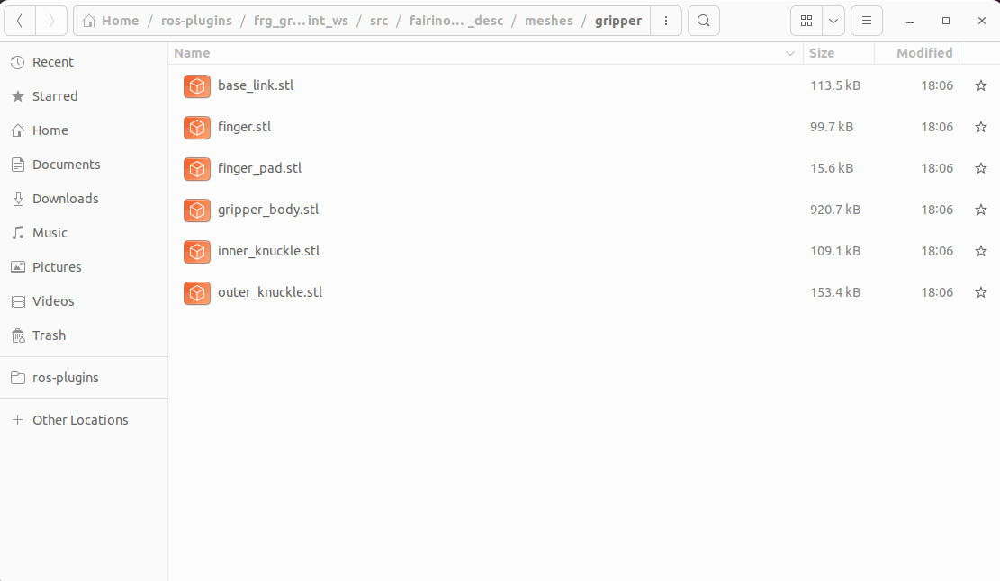
</p>


### 1.3.2 Copy URDF Files

after moving the mesh files you can move the urdf from

From `/path/to/ros-plugin/frcobot_ros2/fairino_description/urdf`

<p align="center">
  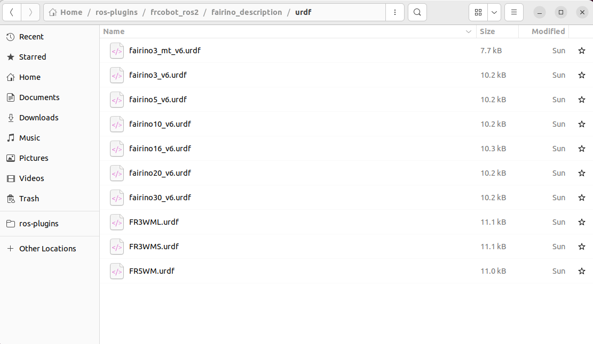
</p>


copy `fairino5_v6.urdf`  file into:

```bash
fairino_gripper_integrated_desc/urdf
```

<p align="center">
  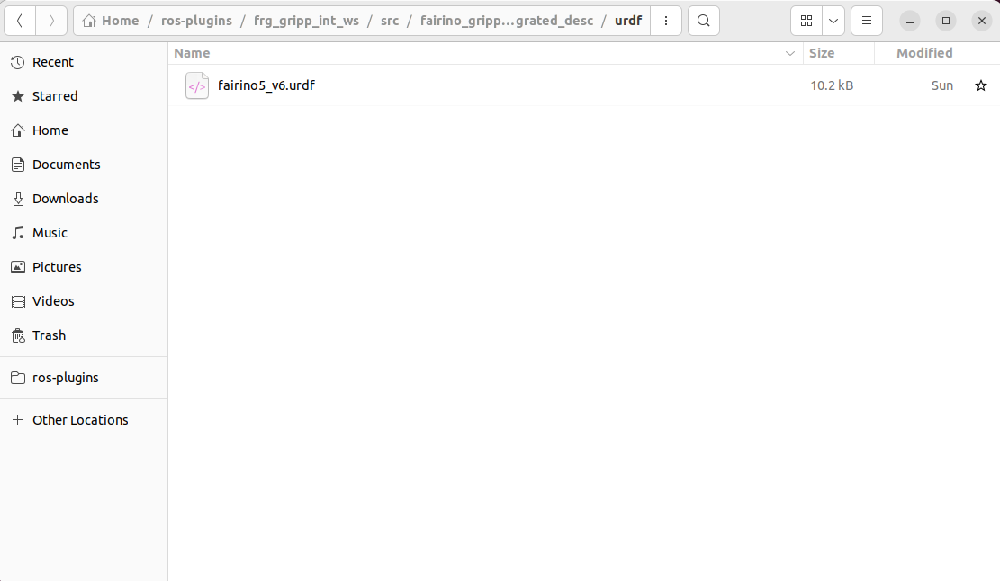
</p>


Then repeat the same process for the gripper files by copying gripper mesh files from:

```text
/path/to/ros-plugin/frg_gripp_int_ws/src/dh_ag95_description/urdf
```
<p align="center">
  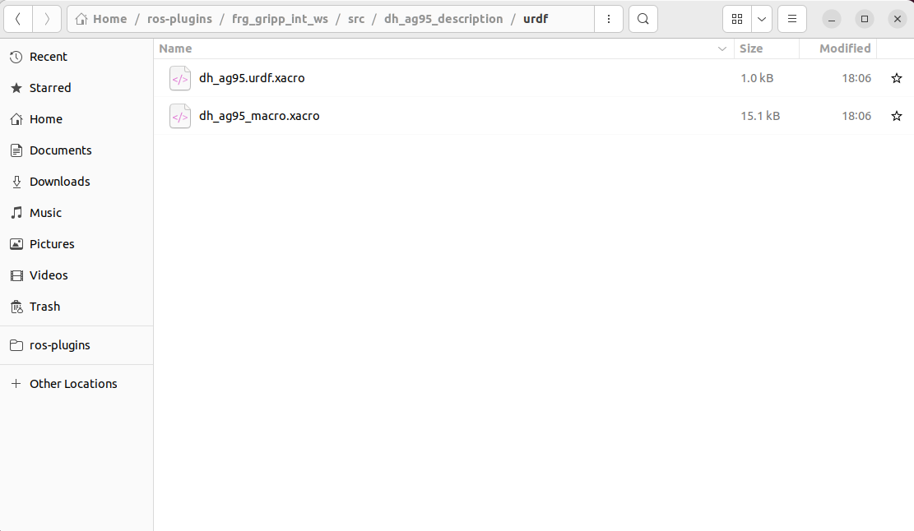
</p>


to:

```text
/path/to/ros-plugin/frg_gripp_int_ws/src/fairino_gripper_integrated_desc/urdf
```


<p align="center">
  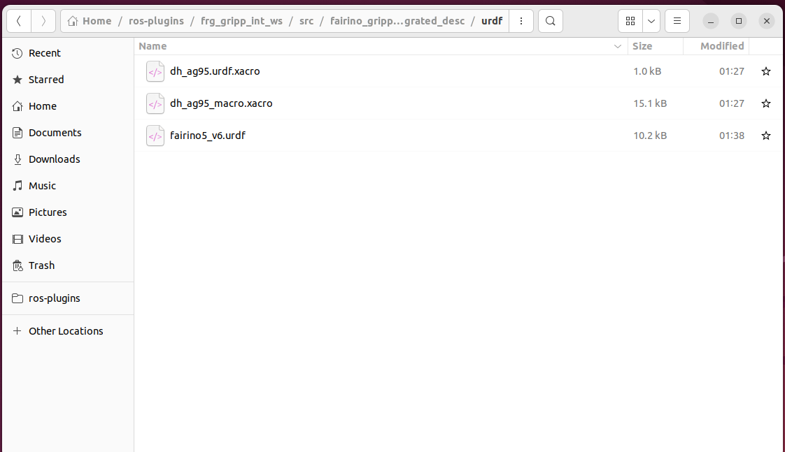
</p>

## 1.4 Integration URDF

Inside the `urdf` folder, create a new Xacro file:

```bash
touch integrated.urdf.xacro
```

Then open the file and integrate the gripper with the robot’s `wrist3_link`:

```xml
<?xml version="1.0"?>
<robot xmlns:xacro="http://www.ros.org/wiki/xacro" name="fairino_with_ag95">

  <!-- Fairino robot description urdf, you might need to modify the file name if you use a different robot model -->
  <xacro:include filename="$(find fairino_gripper_integrated_desc)/urdf/fairino5_v6.urdf" />

  <!-- Gripper macro you might need to modify the file name if you have a different gripper -->
  <xacro:include filename="$(find fairino_gripper_integrated_desc)/urdf/dh_ag95_macro.xacro" />

  <!-- Attach gripper to wrist link, you might need to change the offset of the gripper if needed  -->
  <xacro:dh_ag95_gripper parent="wrist3_link" prefix="gripper_">
    <origin xyz="0 0 0" rpy="0 0 0" />
  </xacro:dh_ag95_gripper>

</robot>
```


## 1.5 Modify the `CMakeLists.txt` & `package.xml` Files

Update the `CMakeLists.txt` file with the following content:

```cmake
cmake_minimum_required(VERSION 3.8)
project(fairino_gripper_integrated_desc)

if(CMAKE_COMPILER_IS_GNUCXX OR CMAKE_CXX_COMPILER_ID MATCHES "Clang")
  add_compile_options(-Wall -Wextra -Wpedantic)
endif()

find_package(ament_cmake REQUIRED)

install(DIRECTORY
  meshes
  urdf
  DESTINATION share/${PROJECT_NAME}
)

ament_package()
```

Update the `package.xml` file with the following content:

```xml
<?xml version="1.0"?>
<?xml-model href="http://download.ros.org/schema/package_format3.xsd" schematypens="http://www.w3.org/2001/XMLSchema"?>

<package format="3">
  <name>fairino_gripper_integrated_desc</name>
  <version>0.0.0</version>

  <description>
    URDF description package for the Fairino integrated gripper
  </description>

  <maintainer email="user@todo.todo">user</maintainer>
  <license>Apache-2.0</license>

  <buildtool_depend>ament_cmake</buildtool_depend>

  <exec_depend>urdf</exec_depend>
  <exec_depend>xacro</exec_depend>

  <export>
    <build_type>ament_cmake</build_type>
  </export>
</package>
```
## 1.6 Test URDF

You can then visualize the setup by using the following command after build

```bash
colcon build

source install/setup.bash

ros2 launch urdf_tutorial display.launch.py model:=$(ros2 pkg prefix fairino_gripper_integrated_desc)/share/fairino_gripper_integrated_desc/urdf/integrated.urdf.xacro
```
<p align="center">
  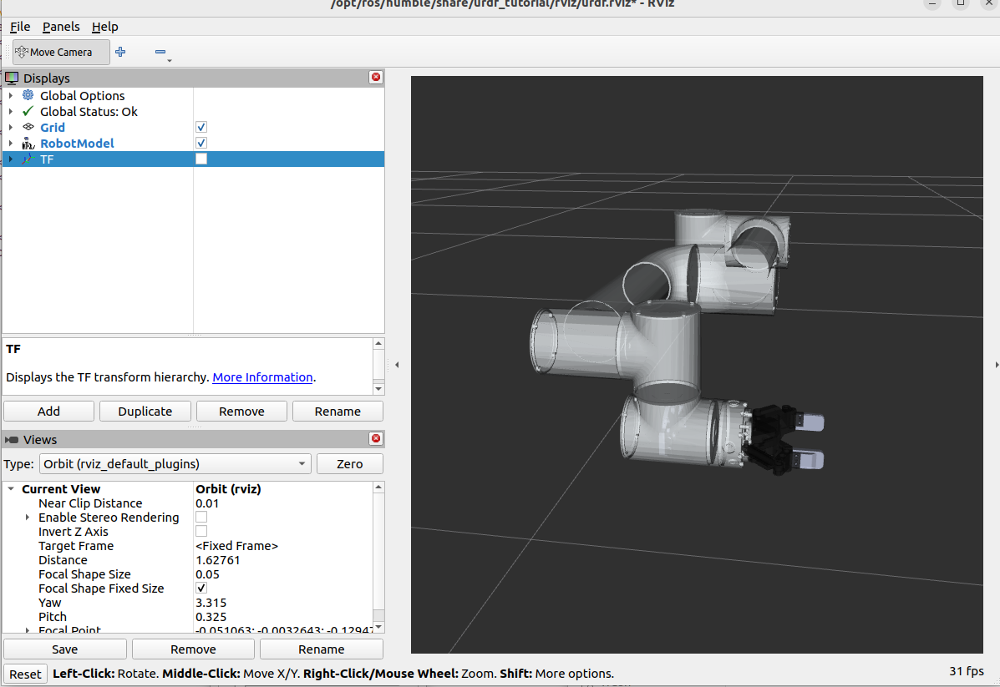
</p>

As shown below, the gripper initially appears to collide with the robot body. To correct this, we can modify the `z` offset value inside the integrated URDF file created earlier.

This adjustment process usually involves some trial and error until the desired alignment is achieved. For example, setting the `z` value in `integrated.urdf` to `0.1` results in the following configuration.

> Note: After modifying the URDF, make sure to rebuild the workspace and source the installation again.

<p align="center">
  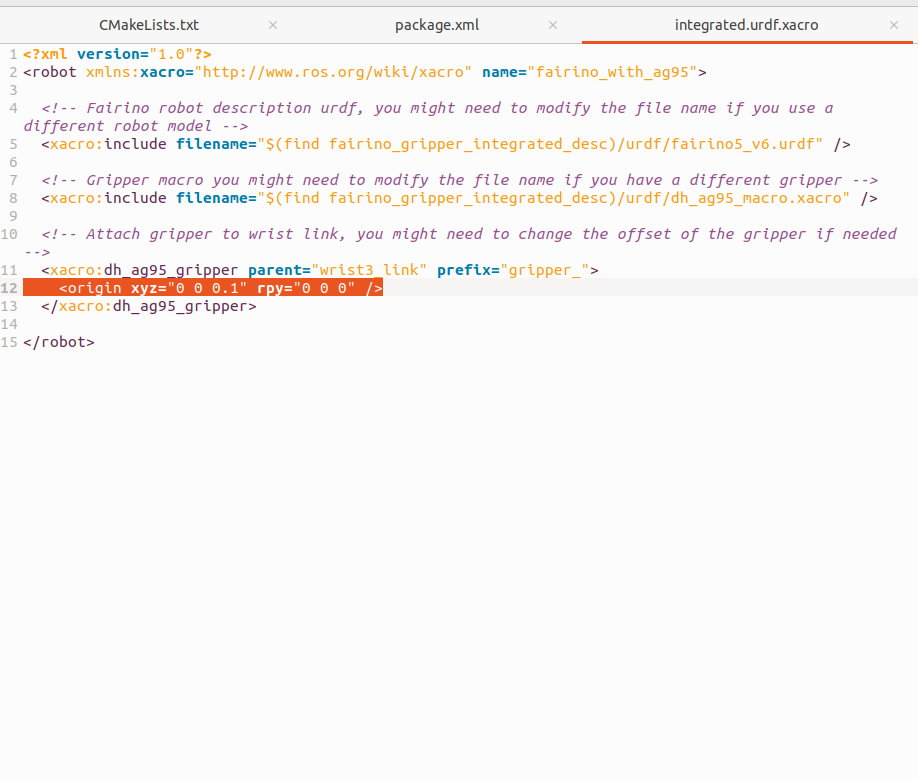
</p>

After applying the modification, the gripper is properly shifted relative to `wrist3`, as shown below.

<p align="center">
  
</p>


## 1.6 Import the integrated model into Moveit2


```bash

source install/setup.bash

ros2 launch moveit_setup_assistant setup_assistant.launch.py

```

