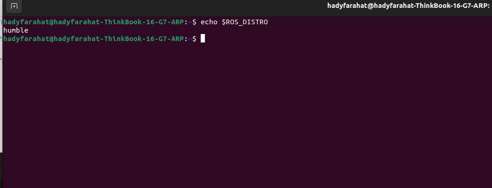

# Fairino MoveIt2

In this tutorial, we focus on the installation and setup of a basic MoveIt environment with the FR5 gripper.

By the end of this tutorial, you are expected to have a solid understanding of MoveIt and its configuration, without involving integration with the cobot simulator or a real cobot.


## 1. Prerequisites
- Ubuntu 22.04
To confirm that you have the proper os version you can use the following command.
```bash
lsb_release -a
```
<p align="center">
  
</p>


- ROS 2 Humble installed
The following command would allow you to confirm that ROS 2 Humbe is installed

```bash
echo $ROS_DISTRO
```

<p align="center">
  
</p>


In case you don't have ROS 2 Humble you still can install it from the following link

## 2. installation steps
### Install Moveit2-Humble

To install moveit you can follow these steps 

```bash
sudo apt update
```

```bash
sudo apt install ros-humble-moveit ros-humble-moveit-setup-assistant
```

After installation you still can validate by using the following command

```bash
ros2 pkg list | grep moveit
```
<p align="center">
  
</p>

Movit now should be ready, you can run the default Moveit2 Demo by using the following command


### Install Fairino Moveit2 Plugin 


