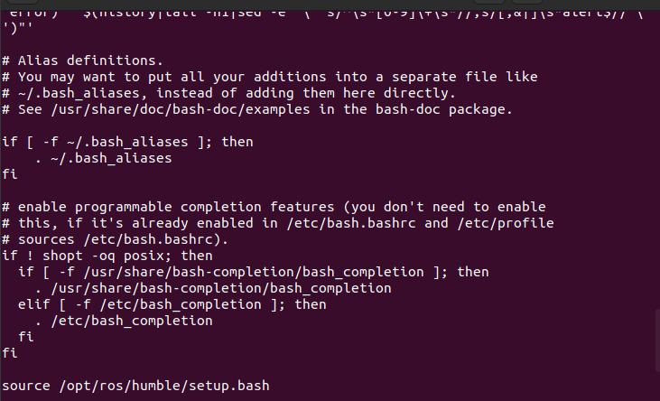
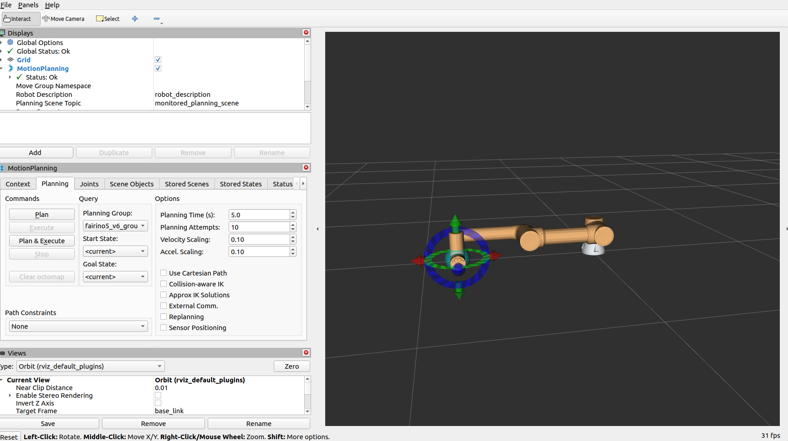

# Fairino Model MoveIt2

In this tutorial, we focus on the installation and setup of a basic MoveIt2 environment using the FR5 cobot.

By the end of this tutorial, you should have a solid understanding of MoveIt2, and how to launch a functional planning environment without integrating a real cobot or simulator.

<p align="center">
  
</p>

---

# 1. Prerequisites

## Ubuntu 22.04

To confirm that you are running the correct Ubuntu version, use the following command:

```bash
lsb_release -a
```

<p align="center">
  
</p>

---

## ROS 2 Humble

To verify that ROS 2 Humble is installed correctly, run:

```bash
echo $ROS_DISTRO
```

<p align="center">
  
</p>

If ROS 2 Humble is not installed, you can install it from the official ROS 2 documentation.

---

# 2. Installation Steps

## Install MoveIt2 for ROS 2 Humble

Update your package list:

```bash
sudo apt update
```

Install MoveIt2 and the MoveIt Setup Assistant:

```bash
sudo apt install ros-humble-moveit ros-humble-moveit-setup-assistant
```

After installation, verify that MoveIt2 was installed successfully:

```bash
ros2 pkg list | grep moveit
```

<p align="center">
  
</p>

MoveIt2 should now be installed and ready to use.

---

## Install the Fairino MoveIt2 Plugin

Clone the `frcobot_ros2` repository:

```bash
git clone https://github.com/FAIR-INNOVATION/frcobot_ros2.git
```

---

## Source ROS 2 Humble

Before building the plugin locally, make sure your ROS 2 environment is sourced correctly.

Open your `.bashrc` file:

```bash
cat ~/.bashrc
```

Ensure the following line exists:

```bash
source /opt/ros/humble/setup.bash
```

<p align="center">
  
</p>

After updating `.bashrc`, reload it using:

```bash
source ~/.bashrc
```

---

## Build the Required Packages

Navigate to your workspace:

```bash
cd ~/path/to/fairino/plugin
```

Build the required packages sequentially:

```bash
colcon build --packages-select fairino_msgs
source install/setup.bash

colcon build --packages-select fairino_hardware_v3_9_5
source install/setup.bash

colcon build --packages-select fairino_description
source install/setup.bash

colcon build --packages-select fairino5_v6_moveit2_config
source install/setup.bash
```

> **Note:**  
> Depending on your robot model and software version, you may need to modify the selected hardware package and MoveIt configuration package accordingly.

---

# 3. Launch the MoveIt2 Demo

Once all packages are built successfully, launch the MoveIt2 demo environment:

```bash
ros2 launch fairino5_v6_moveit2_config demo.launch.py
```

This will start RViz2 with the Fairino FR5 MoveIt2 configuration and allow you to test motion planning with the integrated gripper configuration.


<p align="center">
  
</p>


> **Note:**  
> You MUST source your environment in every new terminal session before running the demo
```bash
source /opt/ros/humble/setup.bash
source ~/path/to/fairino/plugin/install/setup.bash

# Launch MoveIt2 demo
ros2 launch fairino5_v6_moveit2_config demo.launch.py
```
