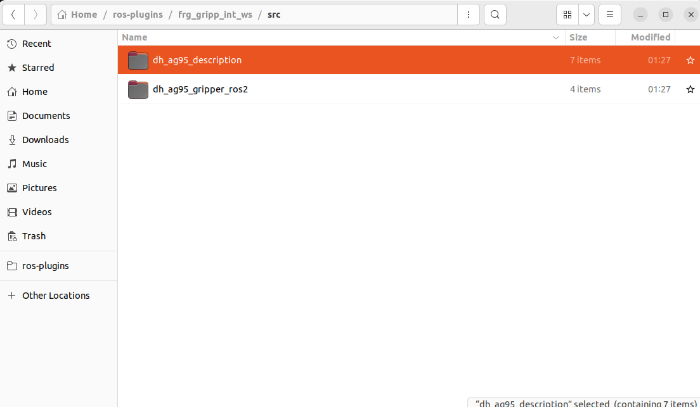
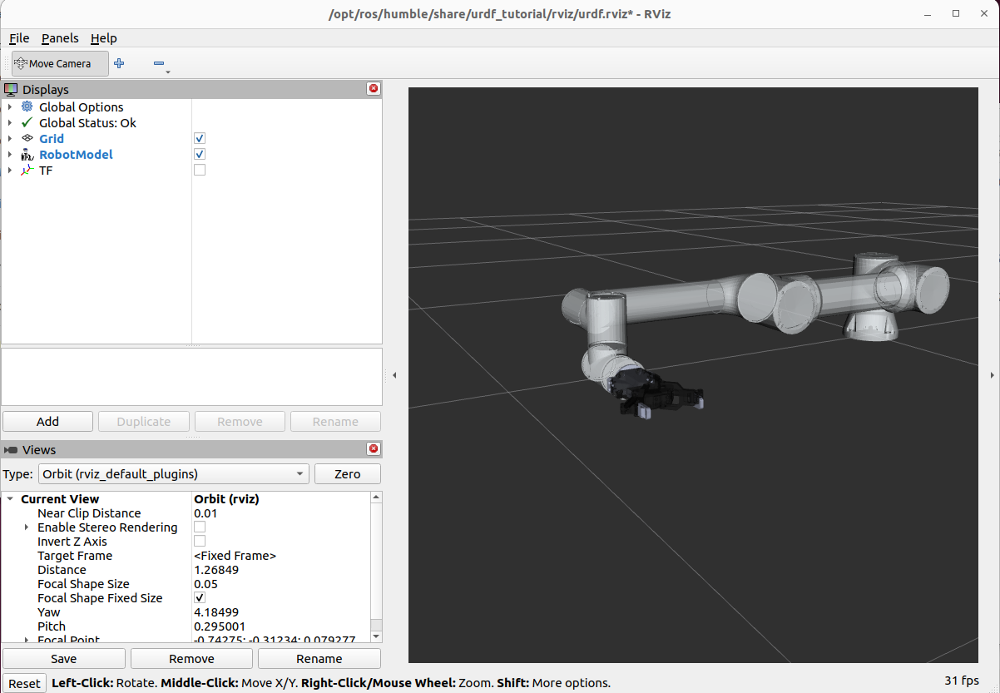

# Integrating gripper and robot 


In this tutoiral we focus on mergin the 
In this tutorial we cover how to integrate a gripper to your cobot, in this tutorial we will use the AG Gripper from DH.


---

# Requirements

Before starting, make sure you have the following installed:

1) Ubuntu 22.04.5 LTS  
2) ROS 2 Humble  
3) Moveit2 with Fairino plugin ready to use.

---

# Installation Steps
## 1. Create the Workspace

Before starting this tutorial, create a new workspace named `frg_gripp_int_ws` as shown in the screenshot below.

Inside the workspace, create a `src` subfolder.

<p align="center">
  
</p>


## 2. Clone the Gripper Repository

We recommend contacting the gripper manufacturer to obtain the required URDF and mesh files.  
In this tutorial, we will use the AG Gripper from DH Robotics.

```bash
cd ~/path/to/ros-plugins/frg_gripp_int_ws/src
git clone https://github.com/ian-chuang/dh_ag95_gripper_ros2.git

```

After cloning the repository, copy the required folder directly into the src directory as shown in the screenshot below.

```bash
cd ~/path/to/ros-plugins/frg_gripp_int_ws/src
cp -r dh_ag95_gripper_ros2/dh_ag95_description

```

<p align="center">
  
</p>


You can then delete the remaining files from `dh_ag95_gripper_ros2`, since they will not be needed for this tutorial.


```bash
rm -rf dh_ag95_gripper_ros2

```


## 3. Copy moveit plugin files

Now go to the rest of the cobot model files and copy them   

```bash
# Go to the frcobot_ros2 plugin repository
cd ~/path/to/plugin/frcobot_ros2
```

```bash
# Copy the MoveIt config package into your configured workspace src folder
cp -r fairino5_v6_moveit2_config ../frg_gripp_int_ws/src/
cp -r fairino_description ../frg_gripp_int_ws/src/
cp -r fairino_hardware_v3_9_5 ../frg_gripp_int_ws/src/
cp -r fairino_msgs ../frg_gripp_int_ws/src/
```
## 3. Create the Integration Package Structure

Create the integration package structure using the following commands:

```bash
cd ~/path/to/plugin/frg_gripp_int_ws/src
mkdir -p fairino_gripper_integrated_desc/meshes/{gripper,robot}
mkdir -p fairino_gripper_integrated_desc/urdf
```

After running the commands, the directory structure should look like this:

```text
fairino_gripper_integrated_desc/
├── meshes
│   ├── gripper
│   └── robot
└── urdf
```

### 3.1 Copy mesh files

Next, copy the required mesh and URDF files into their corresponding folders.

From `/path/to/ros-plugin/frcobot_ros2/fairino_description/fairino5_v6`, copy all `.stl` mesh files into:

```bash
fairino_gripper_integrated_desc/meshes
```

Then repeat the same process for the gripper files by copying:
Copy the gripper mesh files from:

```text
/path/to/ros-plugin/frg_gripp_int_ws/src/dh_ag95_description/meshes/visual
```

to:

```text
/path/to/ros-plugin/frg_gripp_int_ws/src/fairino_gripper_integrated_desc/meshes/gripper
```

### 3.2 Copy URDF Files

after moving the mesh files you can move the urdf from

From `/path/to/ros-plugin/frcobot_ros2/fairino_description/urdf`, copy `fairino5_v6.urdf`  file into:

```bash
fairino_gripper_integrated_desc/urdf
```


Then repeat the same process for the gripper files by copying:
Copy the gripper mesh files from:

```text
/path/to/ros-plugin/frg_gripp_int_ws/src/dh_ag95_description/urdf
```

to:

```text
/path/to/ros-plugin/frg_gripp_int_ws/src/fairino_gripper_integrated_desc/urdf
```


<p align="center">
  
</p>

## 4. Integration URDF

Inside the `urdf` folder, create a new Xacro file:

```bash
touch integrated.urdf.xacro
```

Then open the file and integrate the gripper with the robot’s `wrist3_link`:

```xml
<?xml version="1.0"?>
<robot xmlns:xacro="http://www.ros.org/wiki/xacro" name="fairino_with_ag95">

  <!-- Fairino robot description urdf, you might need to modify the file name if you use a different robot model -->
  <xacro:include filename="$(find fairino_gripper_integrated_desc)/urdf/fairino5_v6.urdf" />

  <!-- Gripper macro you might need to modify the file name if you have a different gripper -->
  <xacro:include filename="$(find fairino_gripper_integrated_desc)/urdf/dh_ag95_macro.xacro" />

  <!-- Attach gripper to wrist link, you might need to change the offset of the gripper if needed  -->
  <xacro:dh_ag95_gripper parent="wrist3_link" prefix="gripper_">
    <origin xyz="0 0 0." rpy="0 0 0.05" />
  </xacro:dh_ag95_gripper>

</robot>
```

## 5. Test URDF

You can then visualize the setup by using the following command after build

```bash
colcon build

source install/setup.bash

ros2 launch urdf_tutorial display.launch.py model:=$(ros2 pkg prefix fairino_gripper_integrated_desc)/share/fairino_gripper_integrated_desc/urdf/integrated.urdf.xacro
```

<p align="center">
  
</p>


## 6. Import the integrated model into Moveit2


```bash

source install/setup.bash

ros2 launch moveit_setup_assistant setup_assistant.launch.py

```

